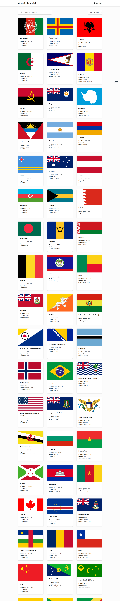
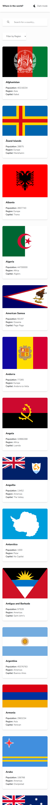
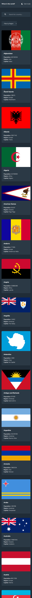
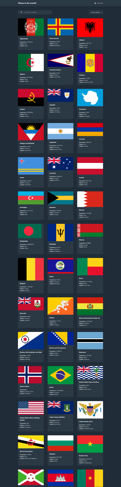

# Frontend Mentor - REST Countries API with color theme switcher solution

This is a solution to the [REST Countries API with color theme switcher challenge on Frontend Mentor](https://www.frontendmentor.io/challenges/rest-countries-api-with-color-theme-switcher-5cacc469fec04111f7b848ca). Frontend Mentor challenges help you improve your coding skills by building realistic projects. 

## Table of contents

- [Frontend Mentor - REST Countries API with color theme switcher solution](#frontend-mentor---rest-countries-api-with-color-theme-switcher-solution)
  - [Table of contents](#table-of-contents)
  - [Overview](#overview)
    - [The challenge](#the-challenge)
    - [Screenshot](#screenshot)
    - [Links](#links)
  - [My process](#my-process)
    - [Built with](#built-with)
    - [What I learned](#what-i-learned)
  - [Author](#author)
  - [Acknowledgments](#acknowledgments)

## Overview

### The challenge

Users should be able to:

- See all countries from the API on the homepage
- Search for a country using an `input` field
- Filter countries by region
- Click on a country to see more detailed information on a separate page
- Click through to the border countries on the detail page
- Toggle the color scheme between light and dark mode *(optional)*

### Screenshot






### Links

- Solution URL: [Add solution URL here](https://your-solution-url.com)
- Live Site URL: [https://countries-lovat-chi.vercel.app/](https://countries-lovat-chi.vercel.app/)

## My process

### Built with

- Semantic HTML5 markup
- CSS custom properties
- Flexbox
- CSS Grid
- Mobile-first workflow
- [React](https://reactjs.org/) - JS library
- [Next.js](https://nextjs.org/) - React framework
- [Tailwind css](https://tailwindcss.com/) - For styles


### What I learned

Working on this project helped me gain a deeper understanding of Next.js 15 and the App Router. I learned how to use dynamic routes to create country detail pages and how to work with URL search parameters to implement search and filtering features.

I also learned how to use `useSearchParams`, `useRouter`, and `URLSearchParams` to keep the UI state synchronized with the URL. To improve the search experience, I implemented debouncing to avoid unnecessary updates while typing.

Another important lesson was working with TypeScript interfaces and adapting my application to changes in a third-party API. This taught me the importance of creating accurate types and handling optional data safely.

One of the features I'm most proud of is the search functionality that updates the URL dynamically:

```tsx
const handleSearch = useDebouncedCallback((country: string) => {
  const params = new URLSearchParams(searchParams);

  if (country) {
    params.set("country", country);
  } else {
    params.delete("country");
  }

  replace(`${pathname}?${params.toString()}`);
}, 300);
```

This project also reinforced my understanding of Server Components, Client Components, and data filtering in React.


## Author

- Website - [[Add your name here](https://nitiema-allassane.vercel.app/)](https://nitiema-allassane.vercel.app/)
- Frontend Mentor - [@yourusername](https://www.frontendmentor.io/profile/NitiemaAllassane)


## Acknowledgments

I would like to thank the Frontend Mentor community for providing this challenge and helping developers improve their frontend skills through real-world projects.

I also used ChatGPT as a learning companion throughout the project. It helped me understand Next.js 15 concepts, debug issues, and explore different implementation approaches. The explanations were especially helpful in strengthening my understanding of dynamic routes, URL search parameters, and TypeScript.
